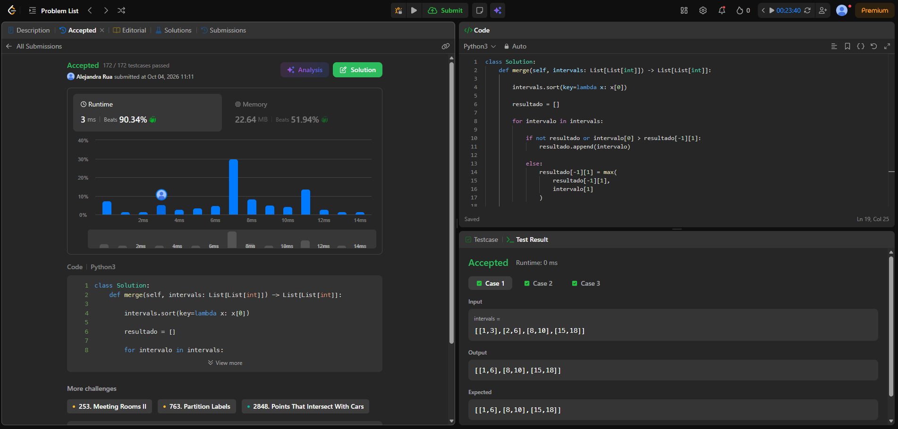
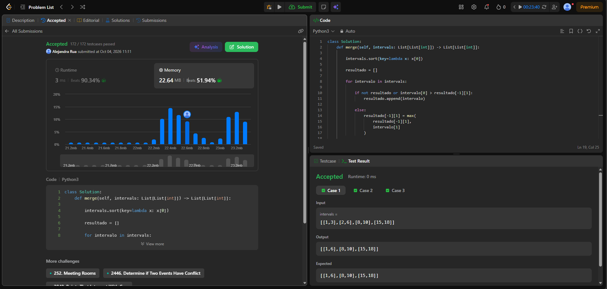
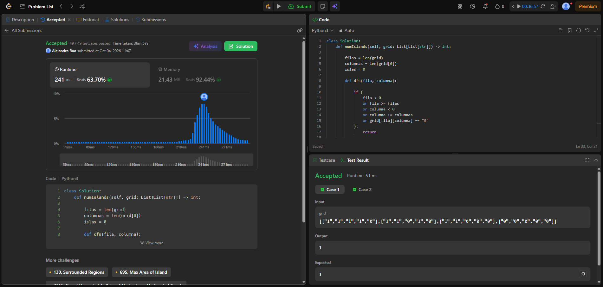
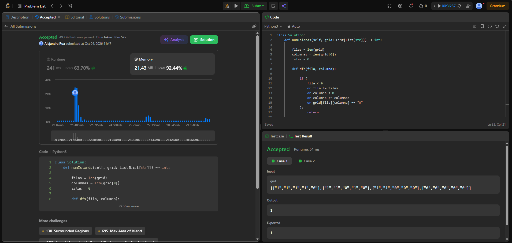

# Taller - Cinco familias en LeetCode

## 56. Merge Intervals

**Familia:** Ordenamiento

**Idea:**  
Primero se ordenan los intervalos por su extremo izquierdo. Luego se recorren y se comparan con el último intervalo agregado. Si existe solapamiento, se amplía el extremo derecho; de lo contrario, se agrega un nuevo intervalo.

**Complejidad temporal:**  
O(n log n), debido al ordenamiento de los intervalos.

**Complejidad espacial:**  
O(n), debido a la lista utilizada para almacenar los intervalos resultantes.

### Evidencia de Accepted

### Evidencia de memoria

## 200. Number of Islands

**Familia:** Grafos

**Idea:**  
Se recorre toda la matriz y cada vez que se encuentra una celda de tierra `"1"` que no ha sido visitada, se cuenta una nueva isla. Luego se utiliza DFS para recorrer todas las celdas conectadas de esa misma isla y marcarlas como visitadas.

**Modelo del grafo:**  
Cada celda de tierra representa un vértice. Existe una arista entre dos celdas de tierra cuando son vecinas horizontal o verticalmente. Cada isla corresponde a una componente conexa.

**Complejidad temporal:**  
O(m × n), porque cada celda de la matriz se visita como máximo una vez.

**Complejidad espacial:**  
O(m × n) en el peor caso, debido a la pila de llamadas recursivas de DFS.

### Evidencia de Runtime

### Evidencia de Memory

