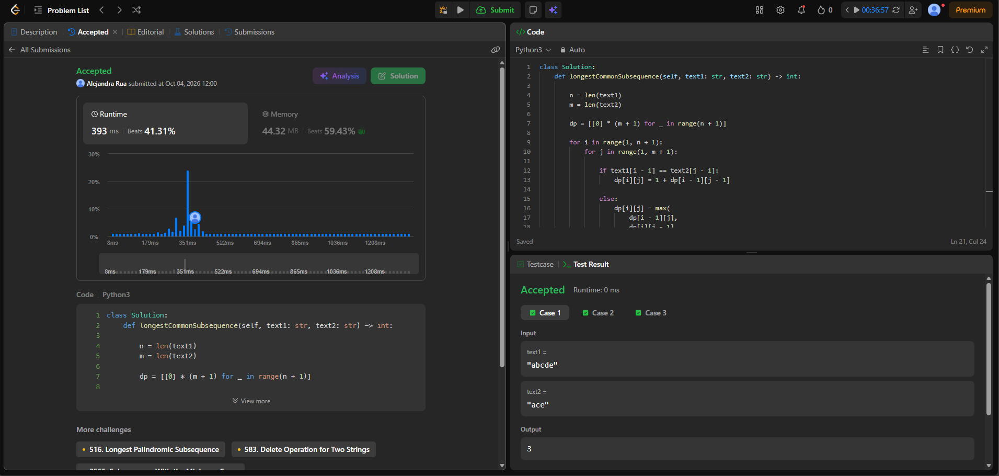
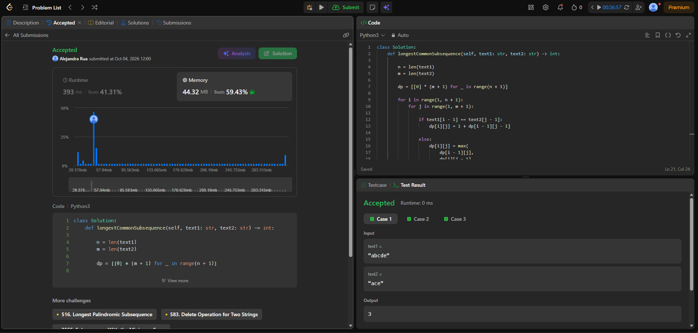
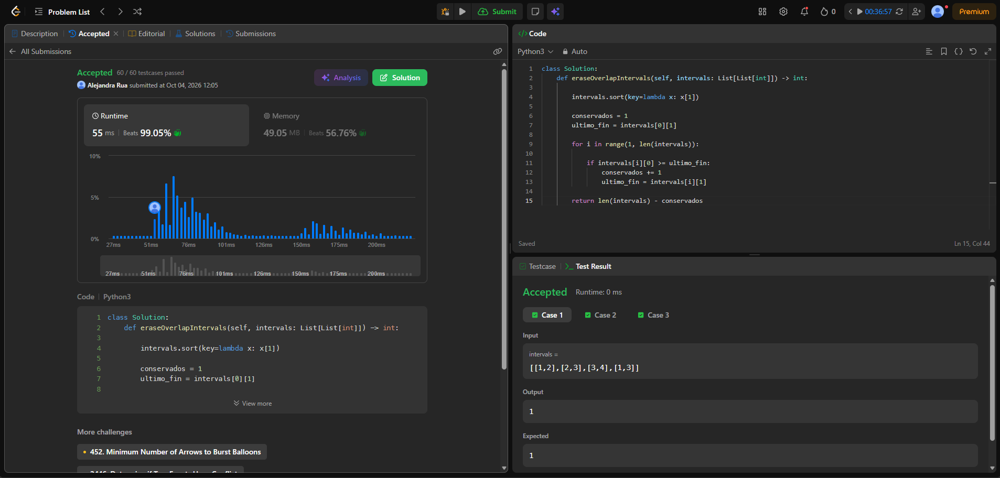
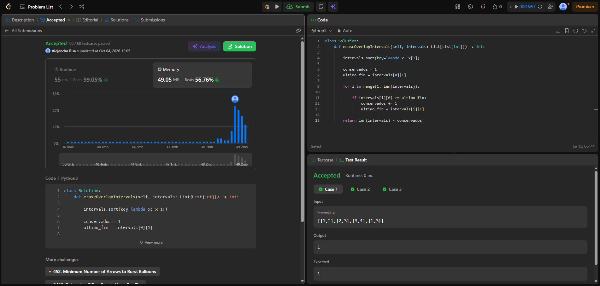
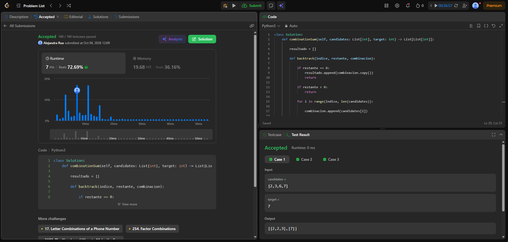
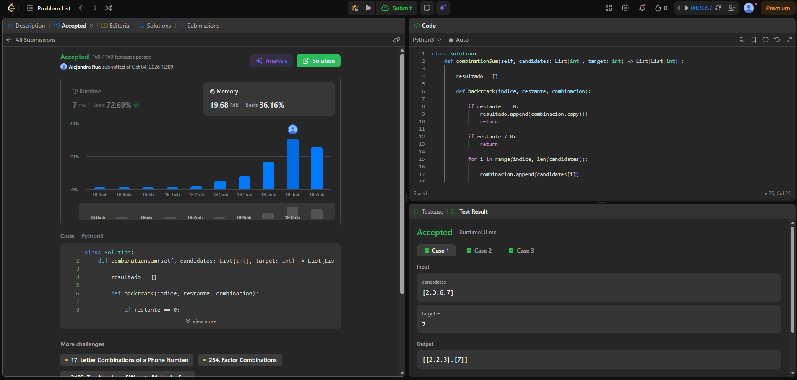

# Taller - Cinco familias en LeetCode

## 56. Merge Intervals

**Problema:**  
https://leetcode.com/problems/merge-intervals/

**Familia:** Ordenamiento

**Idea:**  
Primero se ordenan los intervalos por su extremo izquierdo. Luego se recorren y se comparan con el último intervalo agregado. Si existe solapamiento, se amplía el extremo derecho; de lo contrario, se agrega un nuevo intervalo.

**Complejidad temporal:**  
O(n log n), debido al ordenamiento de los intervalos.

**Complejidad espacial:**  
O(n), debido a la lista utilizada para almacenar los intervalos resultantes.

### Evidencia de Accepted / Runtime

### Evidencia de Memory

---

## 200. Number of Islands

**Problema:**  
https://leetcode.com/problems/number-of-islands/

**Familia:** Grafos

**Idea:**  
Se recorre toda la matriz y cada vez que se encuentra una celda de tierra `"1"` que no ha sido visitada, se cuenta una nueva isla. Luego se utiliza DFS para recorrer todas las celdas conectadas de esa misma isla y marcarlas como visitadas.

**Modelo del grafo:**  
Cada celda de tierra representa un vértice. Existe una arista entre dos celdas de tierra cuando son vecinas horizontal o verticalmente. Cada isla corresponde a una componente conexa.

**Complejidad temporal:**  
O(m × n), porque cada celda de la matriz se visita como máximo una vez.

**Complejidad espacial:**  
O(m × n) en el peor caso, debido a la pila de llamadas recursivas de DFS.

### Evidencia de Runtime

### Evidencia de Memory

---

## 1143. Longest Common Subsequence

**Problema:**  
https://leetcode.com/problems/longest-common-subsequence/

**Familia:** Programación dinámica

**Idea:**  
Se construye una tabla `dp` donde `dp[i][j]` representa la longitud de la subsecuencia común más larga entre los primeros `i` caracteres de `text1` y los primeros `j` caracteres de `text2`.

**Estado:**  
`dp[i][j]` = longitud de la subsecuencia común más larga entre `text1[0..i)` y `text2[0..j)`.

**Caso base:**  
Si uno de los textos está vacío, la longitud de la subsecuencia común es 0.

**Recurrencia:**  
Si `text1[i-1] == text2[j-1]`, se suma 1 al valor diagonal anterior.  
Si son diferentes, se toma el máximo entre ignorar un carácter de `text1` o uno de `text2`.

**Complejidad temporal:**  
O(n × m)

**Complejidad espacial:**  
O(n × m)

### Evidencia de Runtime

### Evidencia de Memory

---

## 435. Non-overlapping Intervals

**Problema:**  
https://leetcode.com/problems/non-overlapping-intervals/

**Familia:** Greedy

**Idea:**  
Se ordenan los intervalos según su extremo derecho. Luego se recorren y se conserva cada intervalo que empiece cuando ya terminó el último intervalo aceptado. Elegir siempre el intervalo que termina primero permite dejar disponible la mayor cantidad de espacio posible para los siguientes intervalos.

**Criterio greedy:**  
En cada paso se selecciona el intervalo compatible que termina más temprano.

**Resultado:**  
Se maximiza la cantidad de intervalos que se pueden conservar sin solaparse. La cantidad que se debe eliminar es el total de intervalos menos los intervalos conservados.

**Complejidad temporal:**  
O(n log n), debido al ordenamiento de los intervalos.

**Complejidad espacial:**  
O(1) de espacio extra, sin considerar el espacio interno utilizado por el algoritmo de ordenamiento.

### Evidencia de Runtime

### Evidencia de Memory

---

## 39. Combination Sum

**Problema:**  
https://leetcode.com/problems/combination-sum/

**Familia:** Backtracking

**Idea:**  
Se construyen las combinaciones probando candidatos desde un índice determinado. Cada candidato puede reutilizarse varias veces. Cuando la suma alcanza el objetivo, se guarda una copia de la combinación encontrada.

**Elección:**  
Se agrega un candidato a la combinación actual con `append()`.

**Backtracking:**  
Después de explorar una posibilidad, se elimina el último elemento con `pop()` para regresar al estado anterior y probar otra alternativa.

**Poda:**  
Si el valor restante es menor que 0, esa rama se detiene porque ya no puede formar una combinación válida.

**Evitar combinaciones repetidas:**  
Las llamadas recursivas continúan desde el índice actual, evitando regresar a índices anteriores. De esta forma no se generan permutaciones equivalentes como `[2,3,2]` y `[3,2,2]`.

**Complejidad temporal:**  
Exponencial en el peor caso. Puede expresarse como O(n^(target/min)), donde `n` es la cantidad de candidatos y `min` es el valor del candidato mínimo.

**Complejidad espacial:**  
O(target/min) para la profundidad máxima de la recursión, sin contar el espacio ocupado por las combinaciones de salida.

### Evidencia de Runtime

### Evidencia de Memory

