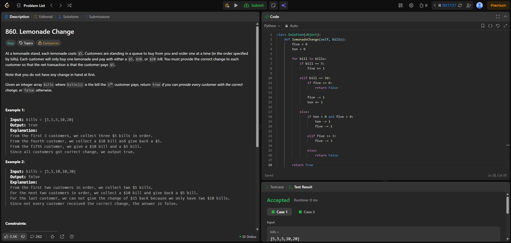
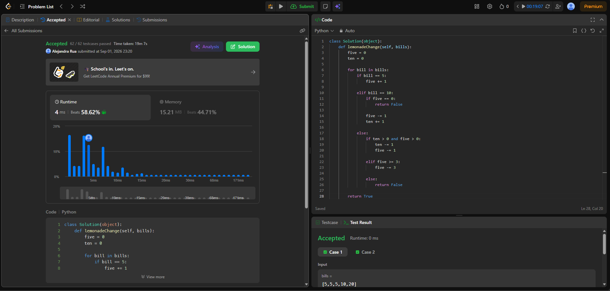
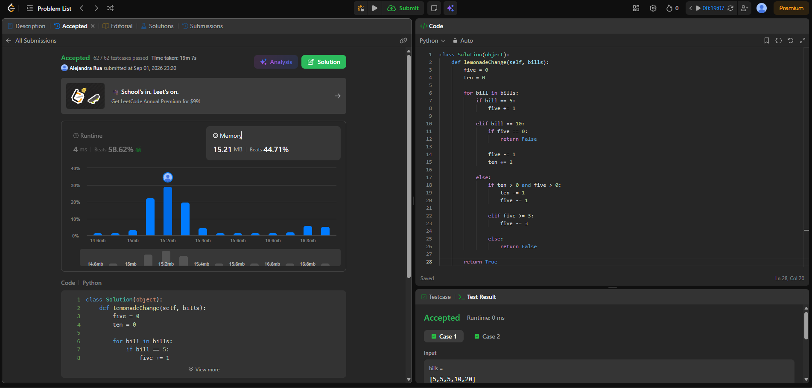
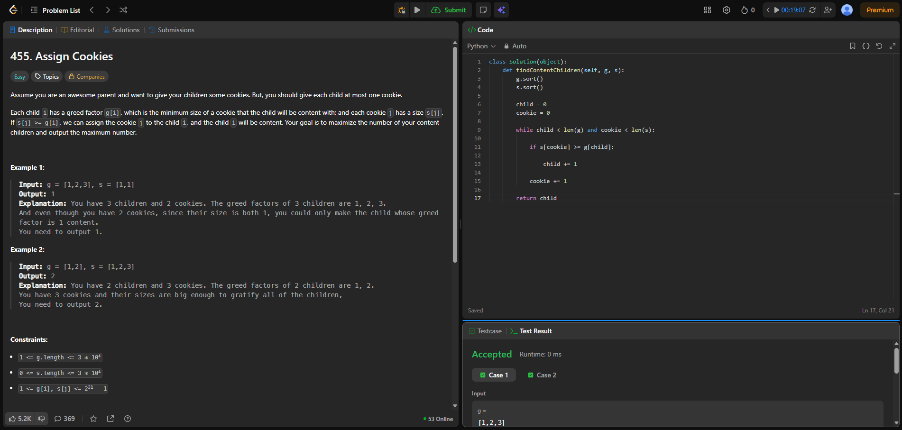
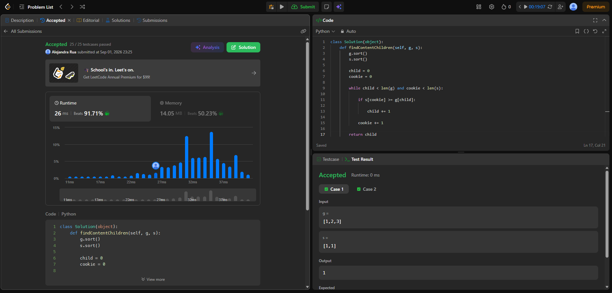
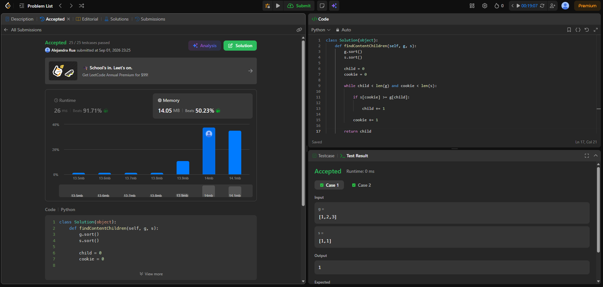

# Tarea 1 · Algoritmos greedy en LeetCode

## 860. Lemonade Change

**Enlace al problema:**  
https://leetcode.com/problems/lemonade-change/

### Criterio greedy

La estrategia consiste en atender a los clientes en el orden en que llegan y entregar el cambio de manera que se conserven los billetes de $5 siempre que sea posible.

Cuando un cliente paga con $20, se intenta primero entregar un billete de $10 y uno de $5. Si esto no es posible, se entregan tres billetes de $5. Esta decisión permite conservar los billetes pequeños, que son necesarios para poder dar cambio a los siguientes clientes.

Si en algún momento no es posible entregar el cambio exacto, se retorna `False`.

### Rendimiento

- **Complejidad de tiempo:** O(n), donde n es la cantidad de clientes, ya que se recorre el arreglo una sola vez.
- **Complejidad de espacio:** O(1), porque únicamente se utilizan variables para almacenar la cantidad de billetes de $5 y $10.

### Evidencia

## 455. Assign Cookies

**Enlace al problema:**  
https://leetcode.com/problems/assign-cookies/

### Criterio greedy

La estrategia consiste en ordenar los niños según su nivel de gula y las galletas según su tamaño, ambos de menor a mayor.

Para cada niño se busca la galleta más pequeña que sea suficiente para satisfacerlo. Si una galleta es demasiado pequeña, se descarta y se prueba la siguiente. Cuando una galleta satisface al niño actual, se asigna y se continúa con el siguiente niño.

De esta manera se evita utilizar una galleta más grande de lo necesario y se maximiza la cantidad de niños satisfechos.

### Rendimiento

- **Complejidad de tiempo:** O(n log n + m log m), debido al ordenamiento de los niños y las galletas. Después se realiza un recorrido lineal.
- **Complejidad de espacio:** O(1) de espacio auxiliar, sin considerar la memoria interna utilizada por el método de ordenamiento.

### Evidencia

