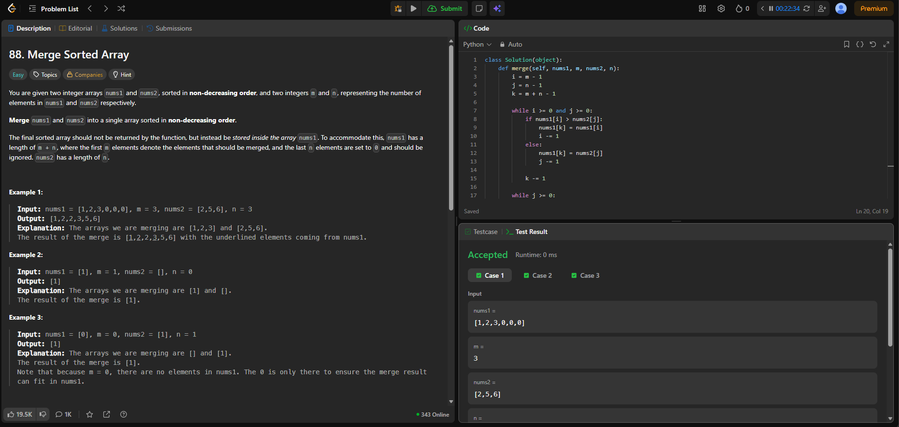
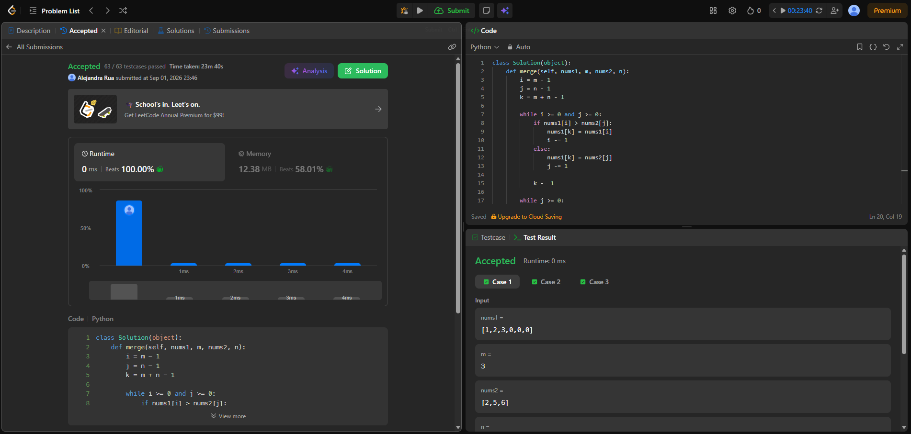
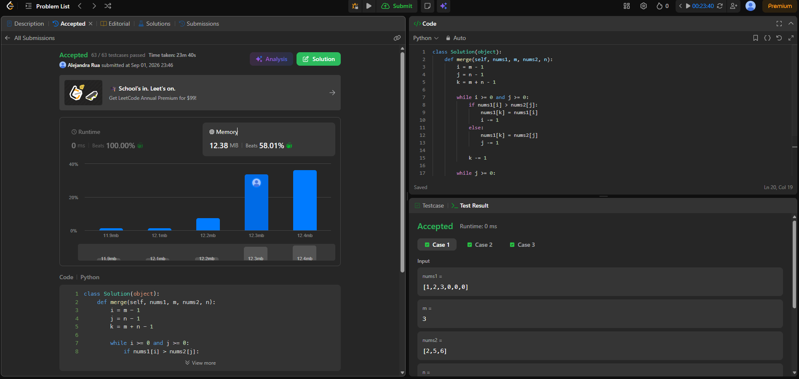
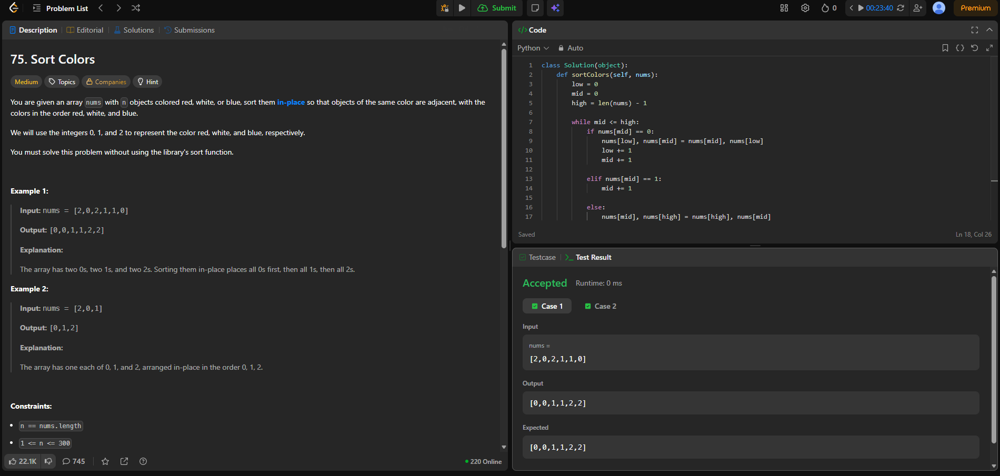
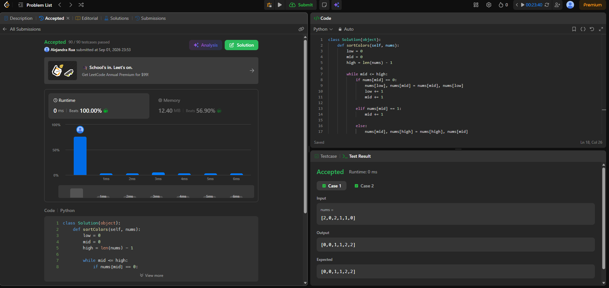
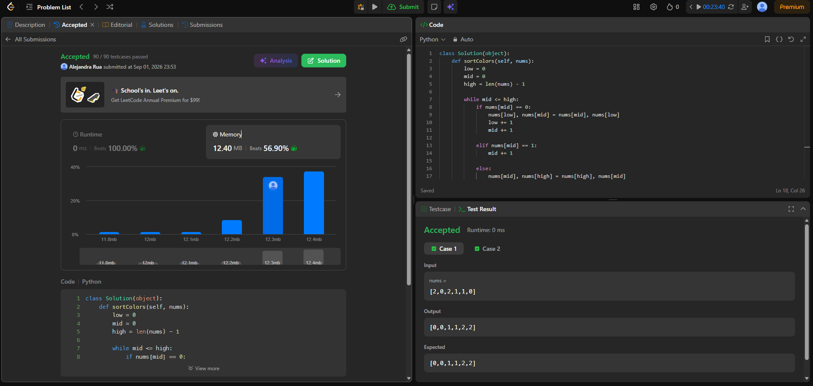

# Tarea 2 · Algoritmos de ordenamiento en LeetCode

## 88. Merge Sorted Array

**Enlace al problema:**  
https://leetcode.com/problems/merge-sorted-array/

### Algoritmo

La estrategia consiste en fusionar los dos arreglos ya ordenados comenzando desde el final de `nums1`.

Se utilizan tres índices: uno para el último elemento válido de `nums1`, otro para el último elemento de `nums2` y otro para la posición donde se debe guardar el siguiente elemento.

En cada paso se comparan los elementos de ambos arreglos y se coloca el mayor en la última posición disponible de `nums1`. De esta manera no se sobrescriben los valores de `nums1` que todavía no han sido procesados.

Si quedan elementos en `nums2`, se copian en las posiciones restantes de `nums1`.

Este método aprovecha que los dos arreglos ya están ordenados y evita utilizar un algoritmo de ordenamiento comparativo sobre todos los elementos.

### Rendimiento

- **Complejidad de tiempo:** O(m + n), donde m es la cantidad de elementos válidos de `nums1` y n es la cantidad de elementos de `nums2`.
- **Complejidad de espacio:** O(1), porque la fusión se realiza directamente sobre `nums1` utilizando únicamente variables auxiliares.

### Evidencia

**Accepted**

**Runtime**

**Memory**

## 75. Sort Colors

**Enlace al problema:**  
https://leetcode.com/problems/sort-colors/

### Algoritmo

La estrategia utilizada es el algoritmo de bandera holandesa mediante tres índices: `low`, `mid` y `high`.

El índice `low` indica dónde deben ubicarse los valores 0, `mid` recorre los elementos que todavía deben clasificarse y `high` indica dónde deben ubicarse los valores 2.

Si el elemento en `mid` es 0, se intercambia con el elemento de `low` y ambos índices avanzan. Si es 1, solamente avanza `mid`. Si es 2, se intercambia con el elemento de `high` y `high` disminuye.

De esta manera los 0 quedan a la izquierda, los 1 en el centro y los 2 a la derecha, realizando el ordenamiento directamente sobre el arreglo y sin utilizar la función `sort()`.

Este método es adecuado porque solo existen tres valores posibles y permite ordenar el arreglo en una sola pasada sin utilizar un algoritmo de ordenamiento comparativo.

### Rendimiento

- **Complejidad de tiempo:** O(n), donde n es la cantidad de elementos del arreglo, ya que cada elemento se procesa como máximo una cantidad constante de veces.
- **Complejidad de espacio:** O(1), porque únicamente se utilizan los tres índices `low`, `mid` y `high`.

### Evidencia

**Accepted**

**Runtime**

**Memory**

